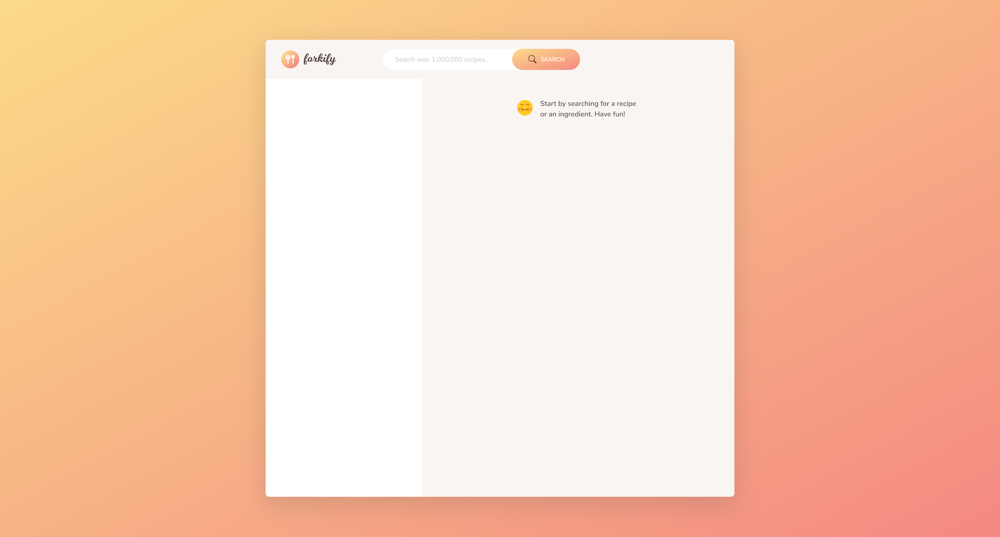
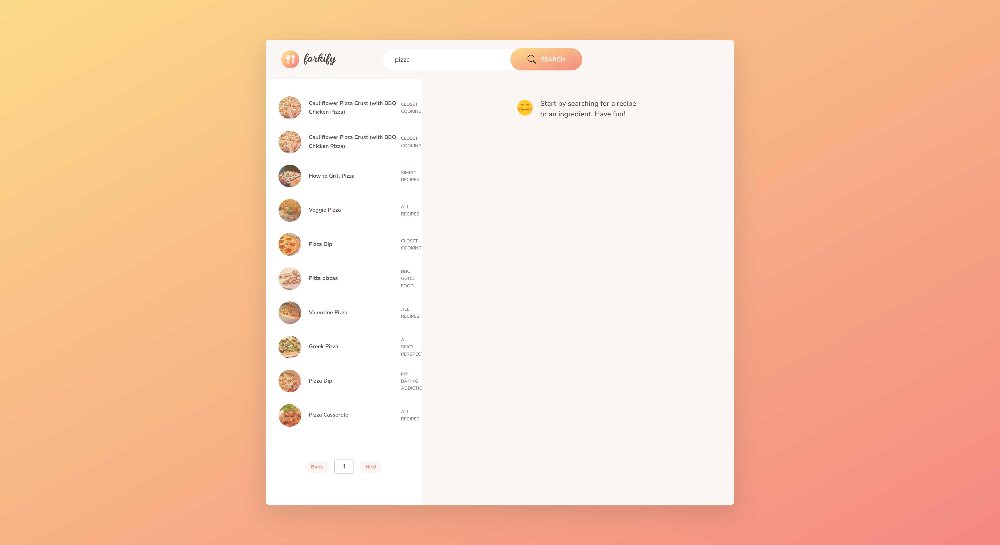
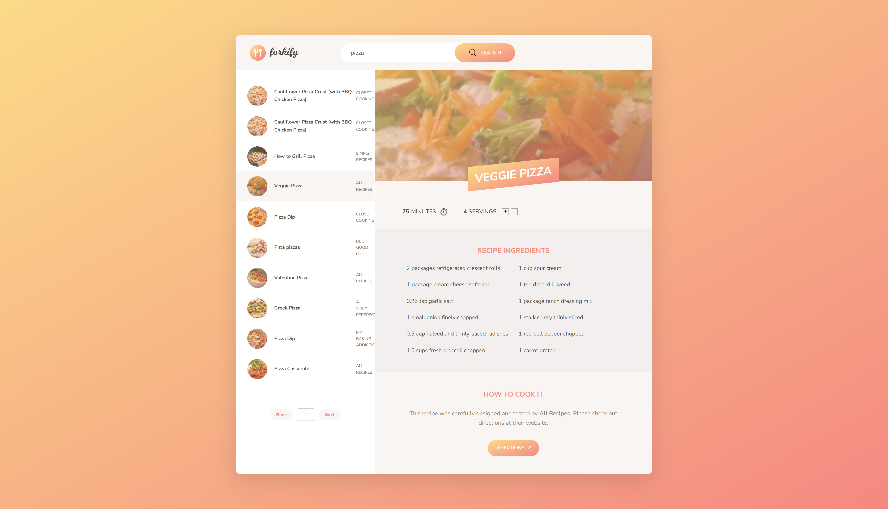
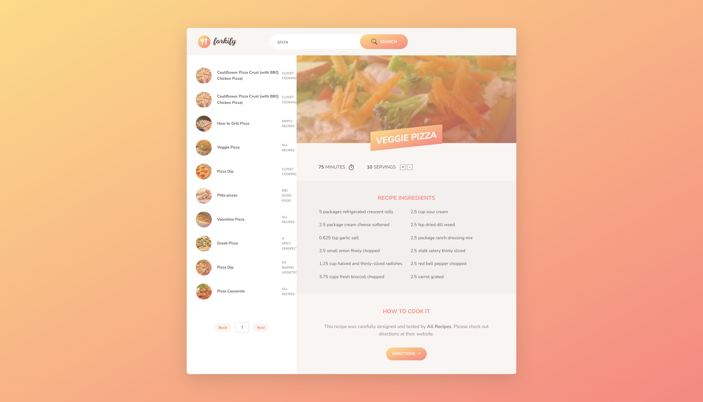
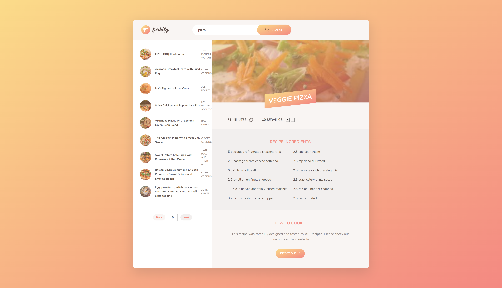
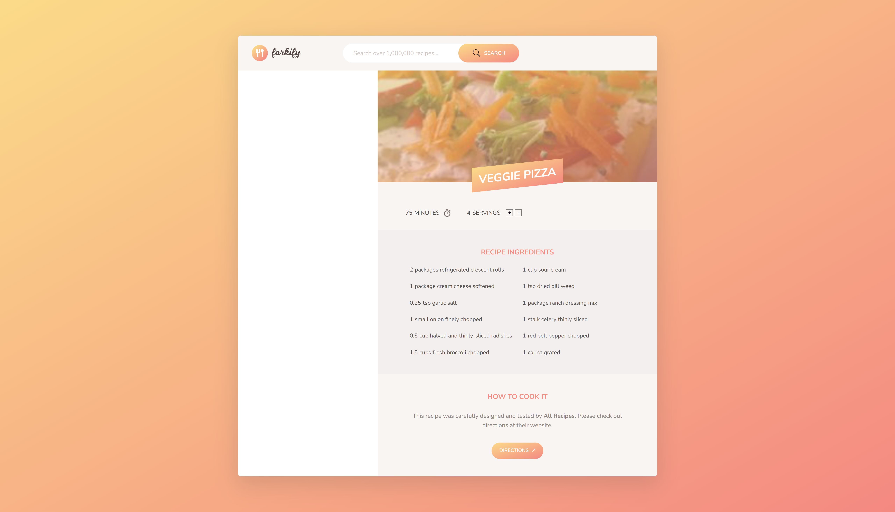

# Forkify

This is a lite version of Forkify app from [Jonas Schedtmann](https://github.com/jonasschmedtmann/complete-javascript-course) course. Basing on starter html and css file personal approach based on MVC principles for business logic was conducted. In this approach, for styling the app SASS was used.

This app utilizes the Forkify API: https://forkify-api.herokuapp.com/v2 and it's limited for GET requests only.

Check out the deployed version of the Forkify app here: [Forkify App](https://rafalbodanka.github.io/forkify-app/)

## Table of Contents

- [Installation](#installation)
- [Usage](#usage)
- [Credits](#credits)

## Installation

1. Open a new terminal and navigate to the root folder.
2. Install the required dependencies by running the following command:

   ```bash
   npm install
   ```

3. Start the development server by running the following command:

   ```bash
   parcel index.html
   ```

Once ther server is running, you should be able to access the app in your web browser at http://localhost:1234.

## Usage



Search for your favourite meals recipes.



Get the recipe details.



Calculate quickly quantities for needed servings.



Use pagination feature to browse through more recipes.



Share link to the particular recipe.



## Credits

This project utilizes most of all the following resources:

- [Parcel](https://parceljs.org/): Popular web application bundler.
- [SASS](https://sass-lang.com/): CSS preprocessor providing more efficient and maintainable features than standard CSS.
- [Jonas Schedtmann](https://github.com/jonasschmedtmann): Original creator of the Forkify app.

The starter HTML and CSS files provided by Jonas Schedtmann were used as the foundation for the app. SASS was implemented to enhance and customize the styling based on the provided CSS. The app follows the MVC architecture as instructed in Jonas Schedtmann's course, ensuring separation of concerns for the business logic.

In addition to the provided code, the following customizations and additions were made:

- Implemented pagination logic to browse through more recipes.
- Developed the recalculating servings logic to quickly adjust quantities.
- Created the share link logic for sharing specific recipes.

These custom functionalities were implemented based on the concepts taught in the course.

Please note that Jonas Schedtmann is the original creator of the Forkify app, and credit goes to him for the initial implementation and instruction.

For more information on how to use the resources utilized in this project, please refer to their respective documentation or official websites.
